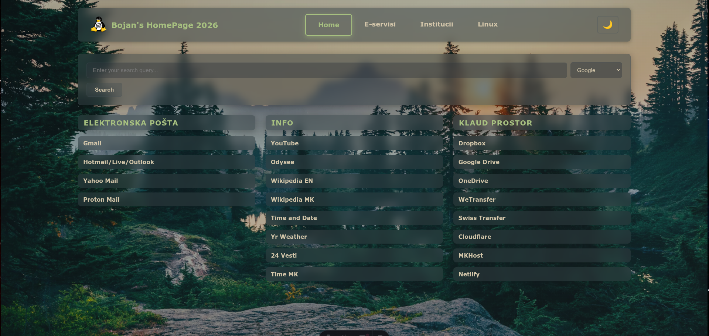

# Astro Bookmark Dashboard

A comprehensive bookmark dashboard built with Astro featuring four main sections:

## Screenshot



## Features

### 🏠 Home Page
- **Search Bar**: Multi-search engine selector (Google, Bing, DuckDuckGo, Yahoo, Yandex, Baidu)
- **Three Link Groups**:
  - **Elektronska Pošta**: Gmail, Hotmail/Live/Outlook, Yahoo Mail, Proton Mail
  - **Info**: YouTube, Odysee, Wikipedia (EN/MK), Time and Date, Yr Weather, 24 Vesti, Time MK
  - **Klaud Prostor**: Dropbox, Google Drive, OneDrive, WeTransfer, Swiss Transfer, Cloudflare, MKHost, Netlify

### 🏛️ E-servisi Page
- Government e-services in a 5-column grid layout
- Services include: TAK Daskalo HRM, HRMIS, E-Obvrzki, E-PDD, E-Danoci, and more

### 🏢 Institucii Page
Three organized sections:
- **Ministerstva**: All government ministries (20 links)
- **Institucii**: Government institutions and agencies (20 links) 
- **Banki**: Banks and financial institutions (21 links)

### 🐧 Linux Page
Four comprehensive sections:
- **Linux Distros**: Popular distributions (20 links)
- **Linux News**: News sites and communities (20 links)
- **Linux Forums & Repos**: Forums, repositories, and resources (21 links)

## Technology Stack

- **Astro 4.x**: Static site generator
- **Pure CSS**: No external CSS frameworks
- **TypeScript**: Type-safe JavaScript
- **Responsive Design**: Mobile-first approach

## Color Scheme

Custom dark theme with:
- Primary Background: `#1a1a2e`
- Secondary Background: `#16213e` 
- Accent Background: `#0f3460`
- Card Background: `#252550`
- Primary Text: `#e94560` (bright red-pink)
- Secondary Text: `#ffffff`
- Muted Text: `#b8b8b8`

## Getting Started

1. **Install Dependencies**:
   ```bash
   npm install
   ```

2. **Start Development Server**:
   ```bash
   npm run dev
   ```

3. **Build for Production**:
   ```bash
   npm run build
   ```

4. **Preview Production Build**:
   ```bash
   npm run preview
   ```

## Project Structure

```
src/
├── layouts/
│   └── Layout.astro          # Main layout with navigation and styling
├── pages/
│   ├── index.astro          # Home page with search and link groups
│   ├── e-servisi.astro      # E-services page
│   ├── institucii.astro     # Institutions page
│   └── linux.astro          # Linux resources page
public/
└── favicon.svg              # Custom favicon
```

## Features

- **Fully Responsive**: Works on desktop, tablet, and mobile devices
- **Search Integration**: Multi-engine search functionality
- **Modern Design**: Clean, professional dark theme
- **Fast Loading**: Optimized static site generation
- **Easy Maintenance**: Well-organized code structure
- **Accessible**: Semantic HTML and proper contrast ratios

## Customization

The design uses CSS custom properties (variables) defined in the main layout, making it easy to customize colors and styling. Simply edit the `:root` section in [Layout.astro](src/layouts/Layout.astro) to change the color scheme.

## Browser Compatibility

- Modern browsers (Chrome 88+, Firefox 78+, Safari 14+, Edge 88+)
- Mobile browsers on iOS and Android
- Responsive design for screens from 320px to 1400px+

---

## For pushing on github
``` git add all && git commit -m "upd Readme.md" && git push origin main ```

Built with ❤️ using Astro